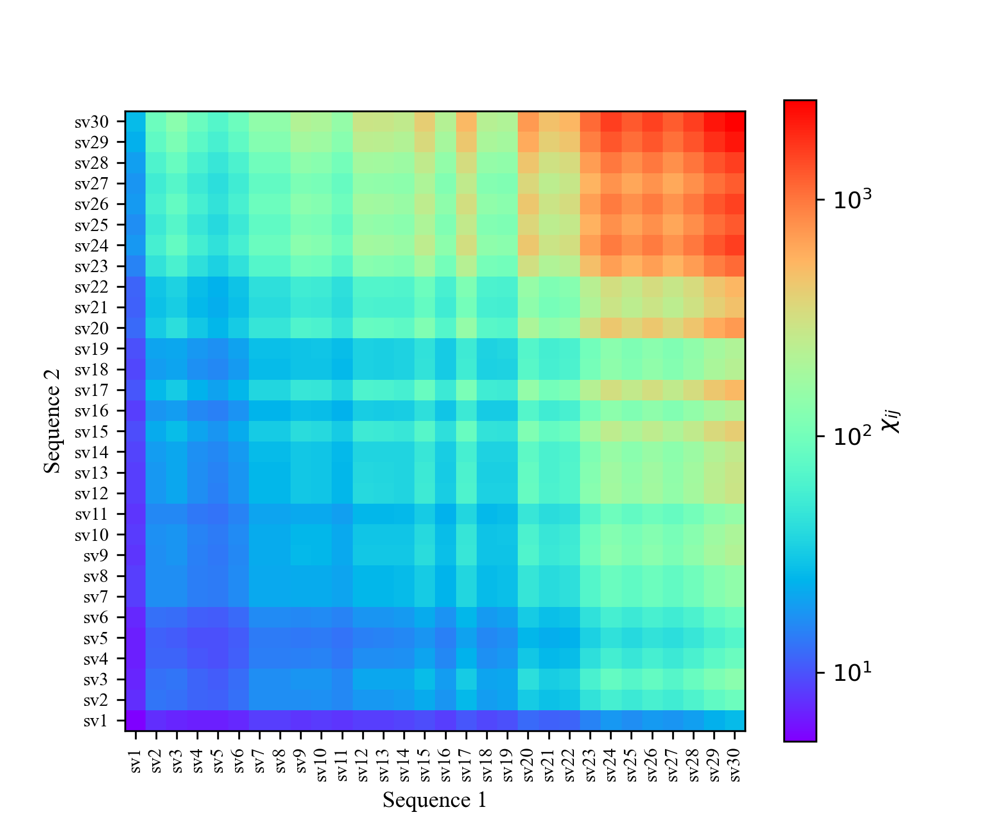

# EPIC-IDP: A Python tool for calculating effective interactions between intrinsically disordered proteins

## About

EPIC-IDP (Effective Protein Interaction Calculator for Intrinsically Disordered Proteins) is a Python package for calculating interaction strengths between intrinsically disordered proteins (IDPs), as quantified by a matrix of effective Flory-Huggins $\chi_{ij}$ parameters, using the IDP amino-acid sequences as input. The $\chi_{ij}$ parameters give information about the propensity to form phase-separated biomolecular condensates and about the partitioning of client proteins inside these condensates. The program accounts for (1) short-range interactions using a mean-field treatment, and (2) long-range electrostatic interactions using the random phase approximation (RPA) theory.

## Usage

### Overview
To use the package, you need to copy the `epic_idp` folder to your working directory or add the path of the `epic_idp` folder to your Python path. You can then import the package using

```python
from epic_idp import chi_effective_calculator
```

Note that the package requires `numpy` to be installed.

The main object of the package is the `chi_effective_calculator` class which is used to calculate the effective $\chi$ parameters between IDPs through the following steps:
- Create an instance of the `chi_effective_calculator` class providing interaction parameters (e.g. the Bjerrum length or short-range interaction parameter set) as input. 
- Add the sequences of all IDPs of interest using the `add_IDP` method. 
- Calculated the effective $\chi$ parameters are using the `calc_chi_eff` and `calc_all_chi_eff` methods.

### Example 1: Polyampholyte sequences
The following example, based on the `example_1.py` script, demonstrates how to use the package to calculate the effective $\chi$ parameters for a set of 50-mer net-neutral artificial sequences of Lysine (K) and Glutamic Acid (E) residues. These 30 sequences are taken from Das and Pappu, PNAS, 2013 (https://www.pnas.org/doi/abs/10.1073/pnas.1304749110), and constitute a popular model system for studying aspects of electrostatically driven IDP phase separation. 

First, we import the `chi_effective_calculator`.

```python
from epic_idp import chi_effective_calculator
```

We next create the `chi_effective_calculator` instance as follows:
```python
cec = chi_effective_calculator(rho0=5., lB=0.8, kappa=0.2, a=0.4)
```
The arguments, given in units of the residue-residue bond length $b$, are:
- `rho0`: A reference density $\rho_0 b^3$ that only provides an overall multiplicative factor to the $\chi$ parameters.
- `lB`: The Bjerrum length $l_{\rm B} / b$ which sets the strength of the electrostatic interactions.
- `kappa`: The inverse screening length (or Debye length) $\kappa b$ which sets the range of the electrostatic interactions. 
- `a`: A Gaussian smearing length $a/b$ that smoothly suppresses the electrostatic interactions at short distances.

The sequences of interest are
```python
seqs = {}
seqs['sv1']  = 'EKEKEKEKEKEKEKEKEKEKEKEKEKEKEKEKEKEKEKEKEKEKEKEKEK'
seqs['sv2']  = 'EEEKKKEEEKKKEEEKKKEEEKKKEEEKKKEEEKKKEEEKKKEEEKKKEK'
seqs['sv3']  = 'KEKKKEKKEEKKEEKEKEKEKEEKKKEEKEKEKEKKKEEKEKEEKKEEEE'
seqs['sv4']  = 'KEKEKKEEKEKKEEEKKEKEKEKKKEEKKKEEKEEKKEEKKKEEKEEEKE'
seqs['sv5']  = 'KEKEEKEKKKEEEEKEKKKKEEKEKEKEKEEKKEEKKKKEEKEEKEKEKE'
seqs['sv6']  = 'EEEKKEKKEEKEEKKEKKEKEEEKKKEKEEKKEEEKKKEKEEEEKKKKEK'
seqs['sv7']  = 'EEEEKKKKEEEEKKKKEEEEKKKKEEEEKKKKEEEEKKKKEEEEKKKKEK'
seqs['sv8']  = 'KKKKEEEEKKKKEEEEKKKKEEEEKKKKEEEEKKKKEEEEKKKKEEEEKE'
seqs['sv9']  = 'EEKKEEEKEKEKEEEEEKKEKKEKKEKKKEEKEKEKKKEKKKKEKEEEKE'
seqs['sv10'] = 'EKKKKKKEEKKKEEEEEKKKEEEKKKEKKEEKEKEEKEKKEKKEEKEEEE'
seqs['sv11'] = 'EKEKKKKKEEEKKEKEEEEKEEEEKKKKKEKEEEKEEKKEEKEKKKEEKK'
seqs['sv12'] = 'EKKEEEEEEKEKKEEEEKEKEKKEKEEKEKKEKKKEKKEEEKEKKKKEKK'
seqs['sv13'] = 'KEKKKEKEKKEKKKEEEKKKEEEKEKKKEEKKEKKEKKEEEEEEEKEEKE'
seqs['sv14'] = 'EKKEKEEKEEEEKKKKKEEKEKKEKKKKEKKKKKEEEEEEKEEKEKEKEE'
seqs['sv15'] = 'KKEKKEKKKEKKEKKEEEKEKEKKEKKKKEKEKKEEEEEEEEKEEKKEEE'
seqs['sv16'] = 'EKEKEEKKKEEKKKKEKKEKEEKKEKEKEKKEEEEEEEEEKEKKEKKKKE'
seqs['sv17'] = 'EKEKKKKKKEKEKKKKEKEKKEKKEKEEEKEEKEKEKKEEKKEEEEEEEE'
seqs['sv18'] = 'KEEKKEEEEEEEKEEKKKKKEKKKEKKEEEKKKEEKKKEEEEEEKKKKEK'
seqs['sv19'] = 'EEEEEKKKKKEEEEEKKKKKEEEEEKKKKKEEEEEKKKKKEEEEEKKKKK'
seqs['sv20'] = 'EEKEEEEEEKEEEKEEKKEEEKEKKEKKEKEEKKEKKKKKKKKKKKKEEE'
seqs['sv21'] = 'EEEEEEEEEKEKKKKKEKEEKKKKKKEKKEKKKKEKKEEEEEEKEEEKKK'
seqs['sv22'] = 'KEEEEKEEKEEKKKKEKEEKEKKKKKKKKKKKKEKKEEEEEEEEKEKEEE'
seqs['sv23'] = 'EEEEEKEEEEEEEEEEEKEEKEKKKKKKEKKKKKKKEKEKKKKEKKEEKK'
seqs['sv24'] = 'EEEEKEEEEEKEEEEEEEEEEEEKKKEEKKKKKEKKKKKKKEKKKKKKKK'
seqs['sv25'] = 'EEEEEEEEEEEKEEEEKEEKEEKEKKKKKKKKKKKKKKKKKKEEKKEEKE'
seqs['sv26'] = 'KEEEEEEEKEEKEEEEEEEEEKEEEEKEEKKKKKKKKKKKKKKKKKKKKE'
seqs['sv27'] = 'KKEKKKEKKEEEEEEEEEEEEEEEEEEEEKEEKKKKKKKKKKKKKKKEKK'
seqs['sv28'] = 'EKKKKKKKKKKKKKKKKKKKKKEEEEEEEEEEEEEEEEEEKKEEEEEKEK'
seqs['sv29'] = 'KEEEEKEEEEEEEEEEEEEEEEEEEEEKKKKKKKKKKKKKKKKKKKKKKK'
seqs['sv30'] = 'EEEEEEEEEEEEEEEEEEEEEEEEEKKKKKKKKKKKKKKKKKKKKKKKKK'
seq_names = list(seqs.keys()) # All sequence names
```
We add these sequences to the `chi_effective_calculator` instance as follows:
```python
for seq_name in seq_names:
    cec.add_IDP(seq_name, seqs[seq_name])
```
The 30-by-30 matrix of effective $\chi$ parameters is then calculated using the `calc_all_chi_eff` method:
```python
chi_eff_matrix = cec.calc_all_chi_eff()
```
If we only want the chi parameter between two specific sequences, we can instead call `cec.calc_chi_eff('sv10', 'sv25')`.

The resulting `chi_eff_matrix`is here visualized as a heatmap:



## Background

A common approach to study the phase behaviour of IDPs is the Flory-Huggins model, defined by the free energy density

$`
f(\{ \phi_i \}) = \sum_i \frac{\phi_i}{N_i} \log \phi_i + \phi_{\rm w} \log\phi_{\rm w} - \sum_{i,j} \chi_{ij} \phi_i \phi_j
`$


The main function of the program is to compute $\chi_{ij}$ using the following equation:

$`
\chi_{ij} = \left( \chi_{\rm h}^{(0)} \right)_{ij} + \left( \chi_{\rm e}^{(0)} \right)_{ij} + \left( \chi_{\rm e}^{(1)} \right)_{ij} 
`$

where the three terms correspond to:
- $`\left( \chi_{\rm h}^{(0)} \right)_{ij}`$: Effective $\chi_{ij}$ parameter following from a mean-field treatment of short-range non-electrostatic interactions (e.g., hydrophobic interactions or cation-$`\pi`$ interactions). This only depends on the amino-acid content (composition), but not the residue order (sequence), of the involved proteins.
- $`\left( \chi_{\rm e}^{(0)} \right)_{ij}`$: Effective $\chi_{ij}$ parameter following from a mean-field treatment of long-range electrostatic interactions. This only depends on the net charge per chain of the two proteins.
- $`\left( \chi_{\rm e}^{(1)} \right)_{ij}`$: The first order correction from electrostatic interactions that follows from RPA theory. This term accounts for charge sequence patterns in the amino-acid sequences, and can thus distinguish between IDPs with same composition but different sequences.

The individual contributions are given by

$`
( \chi_{\rm h}^{(0)} )_{ij} = - \left( \int \mathrm{d} \mathbf{r} \, V_{\rm h}(|\mathbf{r}|) \right) \frac{\rho_0}{2N_i N_j} \sum_{\alpha=1}^{N_i} \sum_{\beta = 1}^{N_j} \varepsilon_{r^{(i)}_\alpha , r^{(j)}_\beta } \, . 
`$

$`
\left( \chi_{\rm e}^{(0)} \right)_{ij} = - \frac{2 \pi l_{\rm B} \rho_0 }{\kappa^2} \sigma_i \sigma_j \, . 
`$

$`
\left( \chi_{\rm e}^{(1)} \right)_{ij} = 2 \pi l_{\rm B}^2 \rho_0 \int_0^{\infty}  {\rm d} k \frac{k^2}{\left( k^2 +  \kappa^2 \right)^2} \frac{g_i(k)}{N_i}\frac{g_j(k)}{N_j} 
`$
