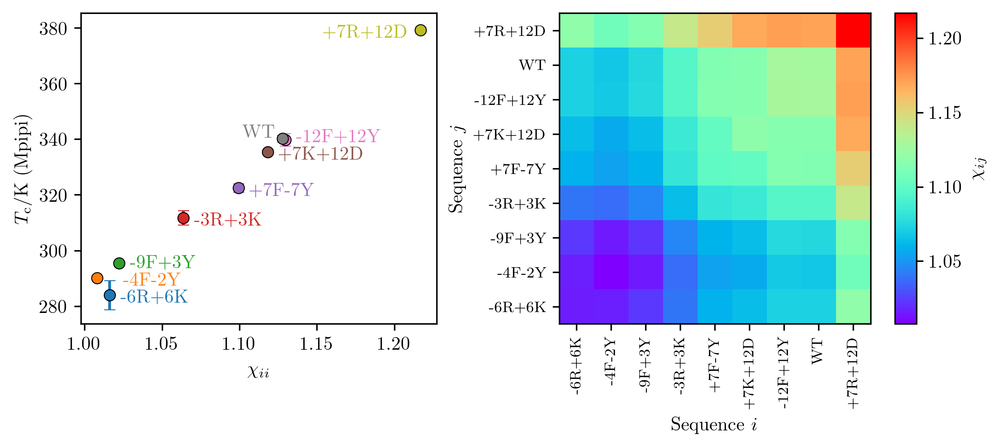

# EPIC-IDP: A Python tool for calculating effective interactions between intrinsically disordered proteins

## About

EPIC-IDP (Effective Protein Interaction Calculator for Intrinsically Disordered Proteins) is a Python package for calculating interaction strengths between intrinsically disordered proteins (IDPs), as quantified by a matrix of effective Flory-Huggins $\chi_{ij}$ parameters, using the IDP amino-acid sequences as input. The $\chi_{ij}$ parameters give information about the propensity to form phase-separated biomolecular condensates and about the partitioning of client proteins inside these condensates. The program accounts for (1) short-range interactions using a mean-field treatment, and (2) long-range electrostatic interactions using the random phase approximation (RPA) theory.

## Usage

### Overview
To use the package, you need to copy the `epic_idp` folder to your working directory or add the path of the `epic_idp` folder to your Python path. You can then import the package using

```python
import epic_idp
```

Note that the package requires `numpy` to be installed.

The main object of the package is the `chi_effective_calculator` class which is used to calculate the effective $\chi$ parameters between IDPs through the following steps:
- Create an instance of the `chi_effective_calculator` class providing interaction parameters (e.g. the Bjerrum length or short-range interaction parameter set) as input. 
- Add the sequences of all IDPs of interest using the `add_IDP` method. 
- Calculated the effective $\chi$ parameters are using the `calc_chi_eff` and `calc_all_chi_eff` methods.

### Example 1: Polyampholyte sequences
The following example, based on the `example_1.py` script, demonstrates how to use the package to calculate the effective $\chi$ parameters among a set of 50-mer net-neutral artificial sequences of Lysine (K) and Glutamic Acid (E) residues. These 30 sequences are taken from Das and Pappu, PNAS, 2013 (https://www.pnas.org/doi/abs/10.1073/pnas.1304749110), and constitute a popular model system for studying aspects of electrostatically driven IDP phase separation. 

First, we import the `chi_effective_calculator`.

```python
from epic_idp import chi_effective_calculator
```

We next create the `chi_effective_calculator` instance as follows:
```python
cec = chi_effective_calculator(rho0=5., lB=0.8, kappa=0.2, a=0.4)
```
The arguments, given in units of the residue-residue bond length $b$, are:
- `rho0`: A reference density $\rho_0 b^3$ that only provides an overall multiplicative factor to the $\chi$ parameters.
- `lB`: The Bjerrum length $l_{\rm B} / b$ which sets the strength of the electrostatic interactions.
- `kappa`: The inverse screening length (or Debye length) $\kappa b$ which sets the range of the electrostatic interactions. 
- `a`: A Gaussian smearing length $a/b$ that smoothly suppresses the electrostatic interactions at short distances.

The sequences of interest are
```python
seqs = {}
seqs['sv1']  = 'EKEKEKEKEKEKEKEKEKEKEKEKEKEKEKEKEKEKEKEKEKEKEKEKEK'
seqs['sv2']  = 'EEEKKKEEEKKKEEEKKKEEEKKKEEEKKKEEEKKKEEEKKKEEEKKKEK'
seqs['sv3']  = 'KEKKKEKKEEKKEEKEKEKEKEEKKKEEKEKEKEKKKEEKEKEEKKEEEE'
seqs['sv4']  = 'KEKEKKEEKEKKEEEKKEKEKEKKKEEKKKEEKEEKKEEKKKEEKEEEKE'
seqs['sv5']  = 'KEKEEKEKKKEEEEKEKKKKEEKEKEKEKEEKKEEKKKKEEKEEKEKEKE'
seqs['sv6']  = 'EEEKKEKKEEKEEKKEKKEKEEEKKKEKEEKKEEEKKKEKEEEEKKKKEK'
seqs['sv7']  = 'EEEEKKKKEEEEKKKKEEEEKKKKEEEEKKKKEEEEKKKKEEEEKKKKEK'
seqs['sv8']  = 'KKKKEEEEKKKKEEEEKKKKEEEEKKKKEEEEKKKKEEEEKKKKEEEEKE'
seqs['sv9']  = 'EEKKEEEKEKEKEEEEEKKEKKEKKEKKKEEKEKEKKKEKKKKEKEEEKE'
seqs['sv10'] = 'EKKKKKKEEKKKEEEEEKKKEEEKKKEKKEEKEKEEKEKKEKKEEKEEEE'
seqs['sv11'] = 'EKEKKKKKEEEKKEKEEEEKEEEEKKKKKEKEEEKEEKKEEKEKKKEEKK'
seqs['sv12'] = 'EKKEEEEEEKEKKEEEEKEKEKKEKEEKEKKEKKKEKKEEEKEKKKKEKK'
seqs['sv13'] = 'KEKKKEKEKKEKKKEEEKKKEEEKEKKKEEKKEKKEKKEEEEEEEKEEKE'
seqs['sv14'] = 'EKKEKEEKEEEEKKKKKEEKEKKEKKKKEKKKKKEEEEEEKEEKEKEKEE'
seqs['sv15'] = 'KKEKKEKKKEKKEKKEEEKEKEKKEKKKKEKEKKEEEEEEEEKEEKKEEE'
seqs['sv16'] = 'EKEKEEKKKEEKKKKEKKEKEEKKEKEKEKKEEEEEEEEEKEKKEKKKKE'
seqs['sv17'] = 'EKEKKKKKKEKEKKKKEKEKKEKKEKEEEKEEKEKEKKEEKKEEEEEEEE'
seqs['sv18'] = 'KEEKKEEEEEEEKEEKKKKKEKKKEKKEEEKKKEEKKKEEEEEEKKKKEK'
seqs['sv19'] = 'EEEEEKKKKKEEEEEKKKKKEEEEEKKKKKEEEEEKKKKKEEEEEKKKKK'
seqs['sv20'] = 'EEKEEEEEEKEEEKEEKKEEEKEKKEKKEKEEKKEKKKKKKKKKKKKEEE'
seqs['sv21'] = 'EEEEEEEEEKEKKKKKEKEEKKKKKKEKKEKKKKEKKEEEEEEKEEEKKK'
seqs['sv22'] = 'KEEEEKEEKEEKKKKEKEEKEKKKKKKKKKKKKEKKEEEEEEEEKEKEEE'
seqs['sv23'] = 'EEEEEKEEEEEEEEEEEKEEKEKKKKKKEKKKKKKKEKEKKKKEKKEEKK'
seqs['sv24'] = 'EEEEKEEEEEKEEEEEEEEEEEEKKKEEKKKKKEKKKKKKKEKKKKKKKK'
seqs['sv25'] = 'EEEEEEEEEEEKEEEEKEEKEEKEKKKKKKKKKKKKKKKKKKEEKKEEKE'
seqs['sv26'] = 'KEEEEEEEKEEKEEEEEEEEEKEEEEKEEKKKKKKKKKKKKKKKKKKKKE'
seqs['sv27'] = 'KKEKKKEKKEEEEEEEEEEEEEEEEEEEEKEEKKKKKKKKKKKKKKKEKK'
seqs['sv28'] = 'EKKKKKKKKKKKKKKKKKKKKKEEEEEEEEEEEEEEEEEEKKEEEEEKEK'
seqs['sv29'] = 'KEEEEKEEEEEEEEEEEEEEEEEEEEEKKKKKKKKKKKKKKKKKKKKKKK'
seqs['sv30'] = 'EEEEEEEEEEEEEEEEEEEEEEEEEKKKKKKKKKKKKKKKKKKKKKKKKK'
seq_names = list(seqs.keys()) # All sequence names
```
We add these sequences to the `chi_effective_calculator` instance as follows:
```python
for seq_name in seq_names:
    cec.add_IDP(seq_name, seqs[seq_name])
```
The 30-by-30 matrix of effective $\chi$ parameters is then calculated using the `calc_all_chi_eff` method:
```python
chi_eff_matrix = cec.calc_all_chi_eff()
```
If we only want the chi parameter between two specific sequences, we can instead call `cec.calc_chi_eff('sv10', 'sv25')`.

The resulting `chi_eff_matrix`is here visualized as a heatmap:


### Example 2: A1-LCD Variants

In this example, we consider variants of the low-complexity domain (LCD) the heterogeneous nuclear ribonucleoprotein A1 (hnRNPA1), referred to as A1-LCD. This set of sequences have been studied experimentally (Bremer *et. al*, Nat Chem 2022, https://doi.org/10.1038/s41557-021-00840-w) and form part of the basis for the Mpipi force field (Joseph *et. al*, Nat Comp Sci 2021, https://doi.org/10.1038/s43588-021-00155-3). The code for this example is given in the `example_2.py` script.

The sequences are:

```python
seqs = {}
seqs['WT']      =   'MASASSSQRGRSGSGNFGGGRGGGFGGNDNFGRGGNFSGRGGFGGSRGGGGYGGSGDGYNGFGNDGSNFGGGGSYNDFGNYNNQSSNFGPMKGGNFGGRSSGPYGGGGQYFAKPRNQGGYGGSSSSSSYGSGRRF'
seqs['-3R+3K']  =   'MASASSSQRGKSGSGNFGGGRGGGFGGNDNFGRGGNFSGRGGFGGSKGGGGYGGSGDGYNGFGNDGSNFGGGGSYNDFGNYNNQSSNFGPMKGGNFGGRSSGGSGGGGQYFAKPRNQGGYGGSSSSSSYGSGRKF'
seqs['-4F-2Y']  =   'MASASSSQRGRSGSGNSGGGRGGGFGGNDNFGRGGNSSGRGGFGGSRGGGGYGGSGDGYNGFGNDGSNSGGGGSSNDFGNYNNQSSNFGPMKGGNFGGRSSGGSGGGGQYSAKPRNQGGYGGSSSSSSSGSGRRF'
seqs['-6R+6K']  =   'MASASSSQKGKSGSGNFGGGRGGGFGGNDNFGKGGNFSGRGGFGGSKGGGGYGGSGDGYNGFGNDGSNFGGGGSYNDFGNYNNQSSNFGPMKGGNFGGKSSGGSGGGGQYFAKPRNQGGYGGSSSSSSYGSGRKF'
seqs['+7F-7Y']  =   'MASASSSQRGRSGSGNFGGGRGGGFGGNDNFGRGGNFSGRGGFGGSRGGGGFGGSGDGFNGFGNDGSNFGGGGSFNDFGNFNNQSSNFGPMKGGNFGGRSSGGSGGGGQFFAKPRNQGGFGGSSSSSSFGSGRRF'
seqs['+7K+12D'] =   'MASADSSQRDRDDKGNFGDGRGGGFGGNDNFGRGGNFSDRGGFGGSRGDGKYGGDGDKYNGFGNDGKNFGGGGSYNDFGNYNNQSSNFDPKMGGNFKDRSSGPYDKGGQYFAKPRNQGGYGGSSSSKSYGSDRRF'
seqs['+7R+12D'] =   'MASADSSQRDRDDRGNFGDGRGGGFGGNDNFGRGGNFSDRGGFGGSRGDGRYGGDGDRYNGFGNDGRNFGGGGSYNDFGNYNNQSSNFDPKMGGNFRDRSSGPYDRGGQYFAKPRNQGGYGGSSSSRSYGSDRRF'
seqs['-9F+3Y']  =   'MASASSSQRGRSGSGNFGGGRGGGYGGNDNGGRGGNYSGRGGFGGSRGGGGYGGSGDGYNGGGNDGSNYGGGGSYNDSGNGNNQSSNFGPMKGGNYGGRSSGGSGGGGQYGAKPRNQGGYGGSSSSSSYGSGRRS'
seqs['-12F+12Y']=   'MASASSSQRGRSGSGNYGGGRGGGYGGNDNYGRGGNYSGRGGYGGSRGGGGYGGSGDGYNGYGNDGSNYGGGGSYNDYGNYNNQSSNYGPMKGGNYGGRSSGGSGGGGQYYAKPRNQGGYGGSSSSSSYGSGRRY'
seq_names = list(seqs.keys()) # All sequence names
```

The `chi_effective_calculator` instance is now created with the `interaction_matrix` argument set to `'Mpipi'` to account for the Mpipi force field interaction matrix for short-range interactions.
```python
cec = chi_effective_calculator(rho0=1., lB=1.7, kappa=0.75, a=0.1, Vh0=3.0, interaction_matrix='Mpipi')
```

The sequences are added to the `chi_effective_calculator` instance as before:
```python
for seq_name in seq_names:
    cec.add_IDP(seq_name, seqs[seq_name])
```

The 9-by-9 matrix of effective $\chi$ parameters is then calculated using the `calc_all_chi_eff` method:
```python
chi_eff_matrix = cec.calc_all_chi_eff()
```
The results are shown here:



The left panel shows the diagonal elements $\chi_{ii}$, quantifying the strengths of the self-interactions of the IDPs, against the upper-critical solution temperatures of the corresponding A1-LCD variants, computed in simulations by Bremer *et. al* using Mpipi. The right panel shows all elements of the $\chi$ matrix illustrating the predicted pairwise interaction strengths between the A1-LCD variants.

## Background

A common approach to study the phase behaviour of IDPs is the Flory-Huggins model, defined by the free energy density

$`
f(\{ \phi_i \}) = \sum_i \frac{\phi_i}{N_i} \log \phi_i + \phi_{\rm w} \log\phi_{\rm w} - \sum_{i,j} \chi_{ij} \phi_i \phi_j
`$

Here, $\phi_i$ and $N_i$ are the volume fraction and chain length of species $i$, respectively, and $\phi_{\rm w}$ is the volume fraction of the solvent which is given by $\phi_{\rm w} = 1 - \sum_i \phi_i$. The interaction strength between species $i$ and $j$ is given by the Flory-Huggins parameter $\chi_{ij}$, which may drive phase separation as well as governs the partitioning of client proteins into the condensates.

The $\chi_{ij}$ are often treated as phenomenological parameters that are tuned to fit e.g. experiment or simulation data. However, fundamentally, the $\chi_{ij}$ parameters stem from the underlying interactions at the molecular level between the amino-acid residues of the involved proteins. Given a microscopic model Hamiltonian for the interactions between the amino-acid residues, and the amino-acid sequences of the involved proteins, it is therefore in principle possible to estimate the $\chi_{ij}$ parameters from first principles. 

In Wessén *et al.*, J. Phys. Chem. B, 2022 (https://pubs.acs.org/doi/10.1021/acs.jpcb.2c06181), a field-theoretic model for IDP phase separation is formulated based on a microscopic interaction Hamiltonian that includes pair-wise amino-acid interactions through long-range electrostatic (Coulomb) forces and short-range non-electrostatic (e.g., hydrophobic or cation-$`\pi`$) interactions. The field theory is approximately solved using a mean-field treatment of the short-range interactions and the random phase approximation (RPA) for the long-range electrostatic interactions. At this level of approximation, the short-range interactions lead to a quadratic term (in polymer density) in the free energy, where the coefficient defines a contribution to the effective $\chi_{ij}$ parameters. The long-range electrostatic interactions lead to an integral free energy term that, formally, contains contributions of all powers of the polymer density. In the expansion of the RPA integral in powers of $\phi_i$, the quadratic term defines the RPA contribution to the effective $\chi_{ij}$ parameters.

The EPIC-IDP package implements the calculation of the effective $\chi_{ij}$ parameters based on the above model. The $\chi_{ij}$ parameters are computed as the sum of three terms,

$`
\chi_{ij} = \left( \chi_{\rm e}^{(0)} \right)_{ij} + \left( \chi_{\rm e}^{(1)} \right)_{ij} + \left( \chi_{\rm h}^{(0)} \right)_{ij}
`$

where the three contributions correspond to:
- $`\left( \chi_{\rm e}^{(0)} \right)_{ij}`$: Effective $\chi_{ij}$ parameter following from a mean-field treatment of long-range electrostatic interactions. This only depends on the net charge per chain of the two proteins.
- $`\left( \chi_{\rm e}^{(1)} \right)_{ij}`$: The first order correction from electrostatic interactions that follows from RPA theory. This term accounts for charge sequence patterns in the amino-acid sequences, and can thus distinguish between IDPs with same composition but different sequences.
- $`\left( \chi_{\rm h}^{(0)} \right)_{ij}`$: Effective $\chi_{ij}$ parameter following from a mean-field treatment of short-range non-electrostatic interactions (e.g., hydrophobic interactions or cation-$`\pi`$ interactions). This only depends on the amino-acid content (composition), but not the residue order (sequence) in the involved proteins.

The first term is given by

$`
\left( \chi_{\rm e}^{(0)} \right)_{ij} = - \frac{2 \pi l_{\rm B} \rho_0 }{\kappa^2} \frac{1}{N_i} \left( \sum_{\alpha = 1}^{N_i} \sigma_{i,\alpha} \right)  \frac{1}{N_j} \left( \sum_{\alpha = 1}^{N_j} \sigma_{j,\alpha} \right) 
`$

where $`\sigma_{i,\alpha}`$ is the electric charge of the $\alpha$-th residue on a chain of species $i$. This term also depends on the Bjerrum length $`l_{\rm B} = e^2 / (4 \pi \varepsilon_0 \varepsilon_{\rm r} k_{\rm B} T)`$, the inverse Debye screening length $\kappa$, and an over-all the reference density $\rho_0$. In an NaCl solution, the screening length is related to the salt concentration as $`\kappa = \sqrt{8 \pi l_{\rm B} [{\rm NaCl}] }`$ such that $`\chi_{\rm e}^{(0)}`$ is temperature-independent and inversely proportional to the salt concentration.

The second term is given by

$`
\left( \chi_{\rm e}^{(1)} \right)_{ij} = 2 \pi l_{\rm B}^2 \rho_0 \int_0^{\infty}  {\rm d} k \frac{k^2}{\left( k^2 +  \kappa^2 \right)^2} \frac{g_i(k)}{N_i}\frac{g_j(k)}{N_j} 
`$

where

$`
g_i(k) = \hat{\Gamma}(k)^2 \sum_{\alpha=1}^{N_i} \sum_{\beta = 1}^{N_i} \sigma_{i,\alpha} \sigma_{i,\beta} \, {\rm e}^{-|\alpha-\beta| k^2 b^2/6} 
`$

is a type of form-factor for the charge density of a single IDP species of type $i$, modelled as a chain with Kuhn length $`b`$. $`\hat{\Gamma}(k)`$ describes the spatial distribution  of charge for a single residue, taken to be a smearerd Gaussian with width $`a`$, i.e., $\hat{\Gamma}(k) = \exp(-k^2 a^2/2)$. 

The final term is given by

$`
( \chi_{\rm h}^{(0)} )_{ij} = - \left( \int \mathrm{d} \vec{r} \, V_{\rm h}(|\vec{r}|) \right) \frac{\rho_0}{2N_i N_j} \sum_{\alpha=1}^{N_i} \sum_{\beta = 1}^{N_j} \varepsilon_{r^{(i)}_\alpha , r^{(j)}_\beta } \, . 
`$

Here, $`r^{(i)}_\alpha`$ denotes the amino-acid type of residue $\alpha$ on an IDP type-$i$ molecule This term follows from assuming that the pair-wise short-range interaction potential between two residues of types $`r`$ and $`r'`$, separated by a distance $`|\vec{r}|`$, is described by

$`
V_{r,r'}(|\vec{r}|) = \varepsilon_{r,r'} V_{\rm h}(|\vec{r}|) \, ,
`$

i.e., as a residue-universal interaction potential $`V_{\rm h}(|\vec{r}|)`$ multiplied by residue-specific interaction strengths $`\varepsilon_{r,r'}`$. The entries in the interaction matrix $`\varepsilon_{r,r'}`$ may be gleaned from existing molecular force fields. In the EPIC-IDP module, the interaction matrix is specified by the `interaction_matrix` argument of the `chi_effective_calculator` class, and can be one of the following:
- `'KH-D'`: Table S3 Data in Dignon et al., 2018 (https://doi.org/10.1371/journal.pcbi.1005941)
- `'Mpipi'`: The 20-by-20 matrix for amino-acid pairs in the Mpipi force field, Joseph et al., 2021 (https://doi.org/10.1038/s43588-021-00155-3)
- `'Mpipi_RNA'`: The 24-by-24 matrix including RNA bases in the Mpipi force field. RNA bases are denoted by lower-case letters (`a`, `c`, `g` and `u`) to distinguish them from amino-acids.
- `'CALVADOS1'`: The original CALVADOS hydrophobicity scale in Tesei et al., 2021 (https://doi.org/10.1073/pnas.2111696118)
- `'CALVADOS2'`: The updated CALVADOS hydrophobicity scale in Tesei et al., 2022 (https://doi.org/10.12688/openreseurope.14967.2)
- `'HPS'`: Table S1 in Dignon et al., 2018 (https://doi.org/10.1371/journal.pcbi.1005941)
- `'URRY'`: Table S2 in Regy et al., 2021 (https://doi.org/10.1002/pro.4094)
- `'FB'`: Table S7 in Dannenhoffer-Lafage et al., 2021 (https://doi.org/10.1021/acs.jpcb.0c11479)